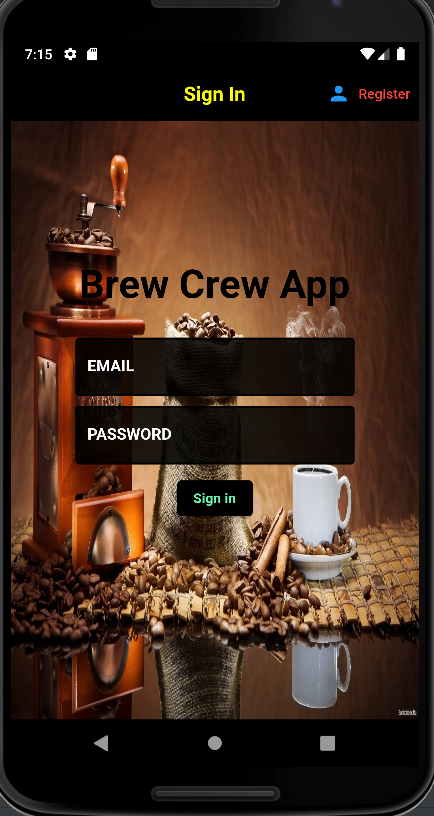
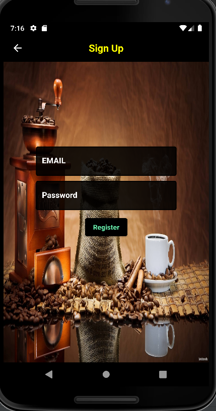
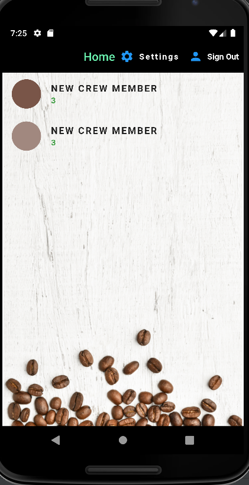
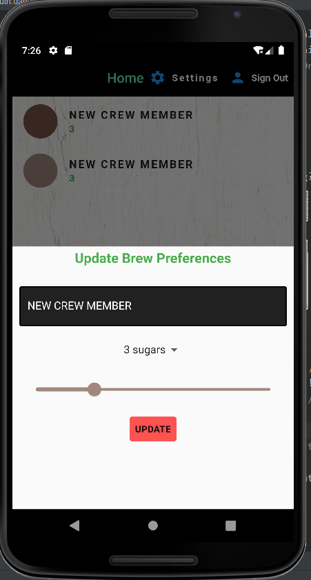

# Brew_cofee_app

A Flutter application which enables multiple users to order coffee based on their preferences.

This app uses Firebase for backend.

For the database storage,it uses cloud firestore and for authentication it uses firebase authentication.

## Sign in page:

### Enables user sign in:

## Register page:

### Enables user registration:

## Home page:

### Enables user to see others as well as their own preferences and according analyze the demand of which type  of coffee is ordered more:

## Enables a user to update his/her brew preferences:

